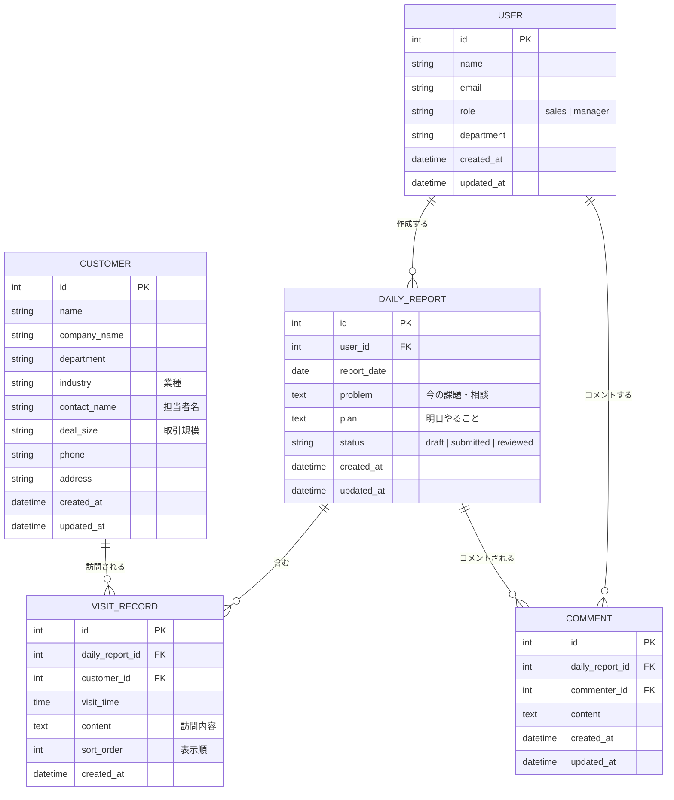

# 営業日報システム 要件定義書

## 1. システム概要

営業担当者が日々の訪問記録・課題・翌日計画を報告し、上長がそれに対してコメントできる営業日報管理システム。

---

## 2. 利用者

| 役割 | 説明 |
|---|---|
| 営業（sales） | 日報を作成・提出する |
| 上長（manager） | 日報を閲覧し、コメントを記入する |

上長と営業の紐付けは行わない。すべての上長がすべての日報を参照できる。

---

## 3. 機能要件

### 3.1 マスタ管理

#### 営業マスタ（ユーザー管理）
- ユーザー（営業・上長）の登録・編集・削除ができる
- 管理項目：氏名、メールアドレス、役割（sales / manager）、部署

#### 顧客マスタ
- 顧客の登録・編集・削除ができる
- 管理項目：顧客名、会社名、部署、業種、担当者名、取引規模、電話番号、住所

---

### 3.2 日報機能

#### 日報作成（営業）
- 1営業担当者につき1日1件の日報を作成できる
- 日報には以下のセクションを含む

| セクション | 説明 |
|---|---|
| 訪問記録 | 訪問した顧客と訪問内容（複数行追加可能） |
| Problem | 今の課題・相談事項（テキスト） |
| Plan | 明日やること（テキスト） |

#### 訪問記録
- 1日報に対して訪問記録を複数件登録できる
- 1件ごとに顧客（顧客マスタから選択）・訪問時刻・訪問内容を記録する
- 表示順を任意に並び替えられる

#### 日報のステータス管理

```
draft（下書き） → submitted（提出済み） → reviewed（確認済み）
```

| ステータス | 説明 |
|---|---|
| draft | 営業が作成中の状態 |
| submitted | 営業が提出した状態 |
| reviewed | 上長が確認済みの状態 |

---

### 3.3 コメント機能

- 上長は日報の Problem / Plan セクションに対してコメントを投稿できる
- コメントは1日報につき複数件投稿可能
- コメントの粒度は日報単位（Problem・Plan を分けない）

---

## 4. 非機能要件（暫定）

| 項目 | 内容 |
|---|---|
| 認証 | ログイン機能によるユーザー認証 |
| 権限制御 | 役割（sales / manager）に応じた操作制限 |
| データ保護 | 自分の日報以外は営業から編集不可 |

---

## 5. データモデル

### ER図



### テーブル定義

#### USER（ユーザー）
| カラム名 | 型 | 制約 | 説明 |
|---|---|---|---|
| id | int | PK | ユーザーID |
| name | string | NOT NULL | 氏名 |
| email | string | NOT NULL, UNIQUE | メールアドレス |
| role | string | NOT NULL | 役割（sales / manager） |
| department | string | | 部署 |
| created_at | datetime | NOT NULL | 作成日時 |
| updated_at | datetime | NOT NULL | 更新日時 |

#### CUSTOMER（顧客）
| カラム名 | 型 | 制約 | 説明 |
|---|---|---|---|
| id | int | PK | 顧客ID |
| name | string | NOT NULL | 顧客名 |
| company_name | string | NOT NULL | 会社名 |
| department | string | | 部署 |
| industry | string | | 業種 |
| contact_name | string | | 担当者名 |
| deal_size | string | | 取引規模 |
| phone | string | | 電話番号 |
| address | string | | 住所 |
| created_at | datetime | NOT NULL | 作成日時 |
| updated_at | datetime | NOT NULL | 更新日時 |

#### DAILY_REPORT（日報）
| カラム名 | 型 | 制約 | 説明 |
|---|---|---|---|
| id | int | PK | 日報ID |
| user_id | int | FK(USER), NOT NULL | 作成者 |
| report_date | date | NOT NULL | 報告日 |
| problem | text | | 今の課題・相談 |
| plan | text | | 明日やること |
| status | string | NOT NULL | ステータス（draft / submitted / reviewed） |
| created_at | datetime | NOT NULL | 作成日時 |
| updated_at | datetime | NOT NULL | 更新日時 |

- UNIQUE 制約: `(user_id, report_date)`

#### VISIT_RECORD（訪問記録）
| カラム名 | 型 | 制約 | 説明 |
|---|---|---|---|
| id | int | PK | 訪問記録ID |
| daily_report_id | int | FK(DAILY_REPORT), NOT NULL | 日報ID |
| customer_id | int | FK(CUSTOMER), NOT NULL | 顧客ID |
| visit_time | time | | 訪問時刻 |
| content | text | NOT NULL | 訪問内容 |
| sort_order | int | NOT NULL | 表示順 |
| created_at | datetime | NOT NULL | 作成日時 |

#### COMMENT（コメント）
| カラム名 | 型 | 制約 | 説明 |
|---|---|---|---|
| id | int | PK | コメントID |
| daily_report_id | int | FK(DAILY_REPORT), NOT NULL | 日報ID |
| commenter_id | int | FK(USER), NOT NULL | コメント投稿者（上長） |
| content | text | NOT NULL | コメント内容 |
| created_at | datetime | NOT NULL | 作成日時 |
| updated_at | datetime | NOT NULL | 更新日時 |

---

## 6. 未決定事項

- 技術スタック（フロントエンド・バックエンド・DB）
- 画面設計・UI/UX
- 通知機能の要否（提出時・コメント時のメール通知など）
- 日報の検索・フィルタリング機能の詳細
