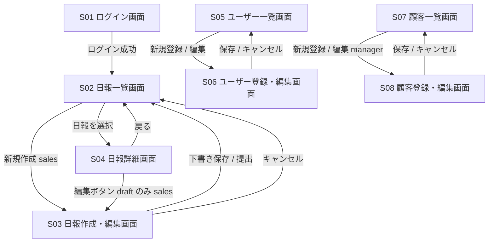

# 営業日報システム 画面定義書

## 1. 画面一覧

| 画面ID | 画面名 | URL | sales | manager |
|---|---|---|---|---|
| S01 | ログイン画面 | `/login` | o | o |
| S02 | 日報一覧画面 | `/reports` | o（自分のみ） | o（全件） |
| S03 | 日報作成・編集画面 | `/reports/new` `/reports/:id/edit` | o（draft のみ編集可） | - |
| S04 | 日報詳細画面 | `/reports/:id` | o（自分のみ） | o（全件） |
| S05 | ユーザー一覧画面 | `/master/users` | - | o |
| S06 | ユーザー登録・編集画面 | `/master/users/new` `/master/users/:id/edit` | - | o |
| S07 | 顧客一覧画面 | `/master/customers` | 参照のみ | o |
| S08 | 顧客登録・編集画面 | `/master/customers/new` `/master/customers/:id/edit` | - | o |

---

## 2. 画面遷移図

---

## 3. 画面詳細定義

---

### S01 ログイン画面

| 項目 | 内容 |
|---|---|
| 画面ID | S01 |
| 画面名 | ログイン画面 |
| URL | `/login` |
| 対象ユーザー | 全員 |
| 概要 | メールアドレスとパスワードで認証する |

#### 表示項目

| 項目 | 種別 | 備考 |
|---|---|---|
| メールアドレス | テキスト入力 | 必須 |
| パスワード | パスワード入力 | 必須 |
| ログインボタン | ボタン | |
| エラーメッセージ | テキスト | 認証失敗時に表示 |

#### アクション

| アクション | 説明 | 遷移先 |
|---|---|---|
| ログイン | 認証成功で日報一覧へ遷移 | S02 |

---

### S02 日報一覧画面

| 項目 | 内容 |
|---|---|
| 画面ID | S02 |
| 画面名 | 日報一覧画面 |
| URL | `/reports` |
| 対象ユーザー | sales（自分の日報のみ） / manager（全件） |
| 概要 | 日報を一覧表示する。絞り込み・ソートが可能 |

#### 表示項目

| 項目 | 種別 | 備考 |
|---|---|---|
| 報告日 | テキスト | |
| 担当者名 | テキスト | manager のみ表示 |
| ステータス | バッジ | draft / submitted / reviewed |
| コメント件数 | テキスト | |
| 日報新規作成ボタン | ボタン | sales のみ表示 |

#### 絞り込み条件

| 条件 | 種別 | 備考 |
|---|---|---|
| 報告日（From / To） | 日付入力 | |
| ステータス | セレクトボックス | |
| 担当者 | セレクトボックス | manager のみ表示 |

#### アクション

| アクション | 説明 | 遷移先 |
|---|---|---|
| 日報を選択 | 日報詳細へ遷移 | S04 |
| 新規作成 | 日報作成画面へ遷移（sales のみ） | S03 |

---

### S03 日報作成・編集画面

| 項目 | 内容 |
|---|---|
| 画面ID | S03 |
| 画面名 | 日報作成・編集画面 |
| URL | `/reports/new` `/reports/:id/edit` |
| 対象ユーザー | sales |
| 概要 | 日報を新規作成、または draft 状態の日報を編集する |

#### 表示項目

**ヘッダー部**

| 項目 | 種別 | 備考 |
|---|---|---|
| 報告日 | 日付入力 | 必須。新規作成時は当日が初期値 |

**訪問記録セクション**（複数行追加可能）

| 項目 | 種別 | 備考 |
|---|---|---|
| 顧客 | セレクトボックス | 顧客マスタから選択。必須 |
| 訪問時刻 | 時刻入力 | |
| 訪問内容 | テキストエリア | 必須 |
| 行の追加ボタン | ボタン | 訪問記録を1件追加 |
| 行の削除ボタン | ボタン | 対象行を削除 |
| 並び替え | ドラッグ＆ドロップ | 表示順を変更 |

**Problem / Plan セクション**

| 項目 | 種別 | 備考 |
|---|---|---|
| Problem（今の課題・相談） | テキストエリア | |
| Plan（明日やること） | テキストエリア | |

**フッター部**

| 項目 | 種別 | 備考 |
|---|---|---|
| 下書き保存ボタン | ボタン | ステータスを draft で保存 |
| 提出ボタン | ボタン | ステータスを submitted に変更して保存 |
| キャンセルボタン | ボタン | 変更を破棄して一覧へ戻る |

#### アクション

| アクション | 説明 | 遷移先 |
|---|---|---|
| 下書き保存 | draft で保存 | S02 |
| 提出 | submitted で保存 | S02 |
| キャンセル | 変更を破棄 | S02 |

#### バリデーション

| 項目 | ルール |
|---|---|
| 報告日 | 必須。同一ユーザー・同一日付の重複不可 |
| 訪問記録 | 最低1件必須（提出時のみ） |
| 訪問記録 > 顧客 | 必須 |
| 訪問記録 > 訪問内容 | 必須 |

---

### S04 日報詳細画面

| 項目 | 内容 |
|---|---|
| 画面ID | S04 |
| 画面名 | 日報詳細画面 |
| URL | `/reports/:id` |
| 対象ユーザー | sales（自分の日報のみ） / manager（全件） |
| 概要 | 日報の内容を閲覧し、上長がコメントを投稿する |

#### 表示項目

**ヘッダー部**

| 項目 | 種別 | 備考 |
|---|---|---|
| 報告日 | テキスト | |
| 担当者名 | テキスト | |
| ステータス | バッジ | |

**訪問記録セクション**

| 項目 | 種別 | 備考 |
|---|---|---|
| 顧客名 | テキスト | |
| 訪問時刻 | テキスト | |
| 訪問内容 | テキスト | |

**Problem / Plan セクション**

| 項目 | 種別 | 備考 |
|---|---|---|
| Problem | テキスト | |
| Plan | テキスト | |

**コメントセクション**

| 項目 | 種別 | 備考 |
|---|---|---|
| コメント一覧 | リスト | 投稿者名・投稿日時・本文を表示（sales は閲覧のみ） |
| コメント入力欄 | テキストエリア | manager のみ表示 |
| コメント投稿ボタン | ボタン | manager のみ表示 |

#### アクション

| アクション | 対象 | 説明 | 遷移先 |
|---|---|---|---|
| 編集 | sales（draft のみ） | 編集画面へ遷移 | S03 |
| 確認済みにする | manager（submitted のみ） | ステータスを reviewed に変更 | - （画面更新） |
| コメント投稿 | manager | コメントを保存 | - （画面更新） |
| 戻る | 全員 | 一覧へ戻る | S02 |

---

### S05 ユーザー一覧画面

| 項目 | 内容 |
|---|---|
| 画面ID | S05 |
| 画面名 | ユーザー一覧画面 |
| URL | `/master/users` |
| 対象ユーザー | manager |
| 概要 | 登録ユーザーを一覧表示する |

#### 表示項目

| 項目 | 種別 | 備考 |
|---|---|---|
| 氏名 | テキスト | |
| メールアドレス | テキスト | |
| 役割 | バッジ | sales / manager |
| 部署 | テキスト | |
| 新規登録ボタン | ボタン | |

#### アクション

| アクション | 説明 | 遷移先 |
|---|---|---|
| 新規登録 | ユーザー登録画面へ遷移 | S06 |
| 編集 | ユーザー編集画面へ遷移 | S06 |

---

### S06 ユーザー登録・編集画面

| 項目 | 内容 |
|---|---|
| 画面ID | S06 |
| 画面名 | ユーザー登録・編集画面 |
| URL | `/master/users/new` `/master/users/:id/edit` |
| 対象ユーザー | manager |
| 概要 | ユーザーを新規登録または編集する |

#### 表示項目

| 項目 | 種別 | 備考 |
|---|---|---|
| 氏名 | テキスト入力 | 必須 |
| メールアドレス | テキスト入力 | 必須。UNIQUE |
| パスワード | パスワード入力 | 新規登録時のみ必須 |
| 役割 | セレクトボックス | sales / manager |
| 部署 | テキスト入力 | |
| 保存ボタン | ボタン | |
| キャンセルボタン | ボタン | |

#### アクション

| アクション | 説明 | 遷移先 |
|---|---|---|
| 保存 | ユーザーを保存 | S05 |
| キャンセル | 変更を破棄 | S05 |

---

### S07 顧客一覧画面

| 項目 | 内容 |
|---|---|
| 画面ID | S07 |
| 画面名 | 顧客一覧画面 |
| URL | `/master/customers` |
| 対象ユーザー | sales（参照のみ） / manager |
| 概要 | 登録顧客を一覧表示する |

#### 表示項目

| 項目 | 種別 | 備考 |
|---|---|---|
| 顧客名 | テキスト | |
| 会社名 | テキスト | |
| 業種 | テキスト | |
| 担当者名 | テキスト | |
| 取引規模 | テキスト | |
| 新規登録ボタン | ボタン | manager のみ表示 |

#### 絞り込み条件

| 条件 | 種別 |
|---|---|
| 顧客名 / 会社名 | テキスト検索 |
| 業種 | セレクトボックス |

#### アクション

| アクション | 対象 | 説明 | 遷移先 |
|---|---|---|---|
| 新規登録 | manager | 顧客登録画面へ遷移 | S08 |
| 編集 | manager | 顧客編集画面へ遷移 | S08 |

---

### S08 顧客登録・編集画面

| 項目 | 内容 |
|---|---|
| 画面ID | S08 |
| 画面名 | 顧客登録・編集画面 |
| URL | `/master/customers/new` `/master/customers/:id/edit` |
| 対象ユーザー | manager |
| 概要 | 顧客を新規登録または編集する |

#### 表示項目

| 項目 | 種別 | 備考 |
|---|---|---|
| 顧客名 | テキスト入力 | 必須 |
| 会社名 | テキスト入力 | 必須 |
| 部署 | テキスト入力 | |
| 業種 | テキスト入力 | |
| 担当者名 | テキスト入力 | |
| 取引規模 | テキスト入力 | |
| 電話番号 | テキスト入力 | |
| 住所 | テキスト入力 | |
| 保存ボタン | ボタン | |
| キャンセルボタン | ボタン | |

#### アクション

| アクション | 説明 | 遷移先 |
|---|---|---|
| 保存 | 顧客情報を保存 | S07 |
| キャンセル | 変更を破棄 | S07 |

---

## 4. 権限マトリクス

| 操作 | sales | manager |
|---|---|---|
| ログイン | o | o |
| 自分の日報を閲覧 | o | o |
| 他人の日報を閲覧 | - | o |
| 日報を新規作成 | o | - |
| 自分の日報を編集（draft のみ） | o | - |
| 日報を提出（draft → submitted） | o | - |
| 日報を確認済みにする（submitted → reviewed） | - | o |
| 日報のコメントを閲覧 | o | o |
| 日報にコメントを投稿 | - | o |
| ユーザーマスタを管理 | - | o |
| 顧客マスタを閲覧 | o | o |
| 顧客マスタを管理 | - | o |

---

## 5. 未決定事項

- sales はコメントを閲覧のみか、返信も可能にするか
- パスワードリセット機能の要否
- ログアウト後のリダイレクト先
